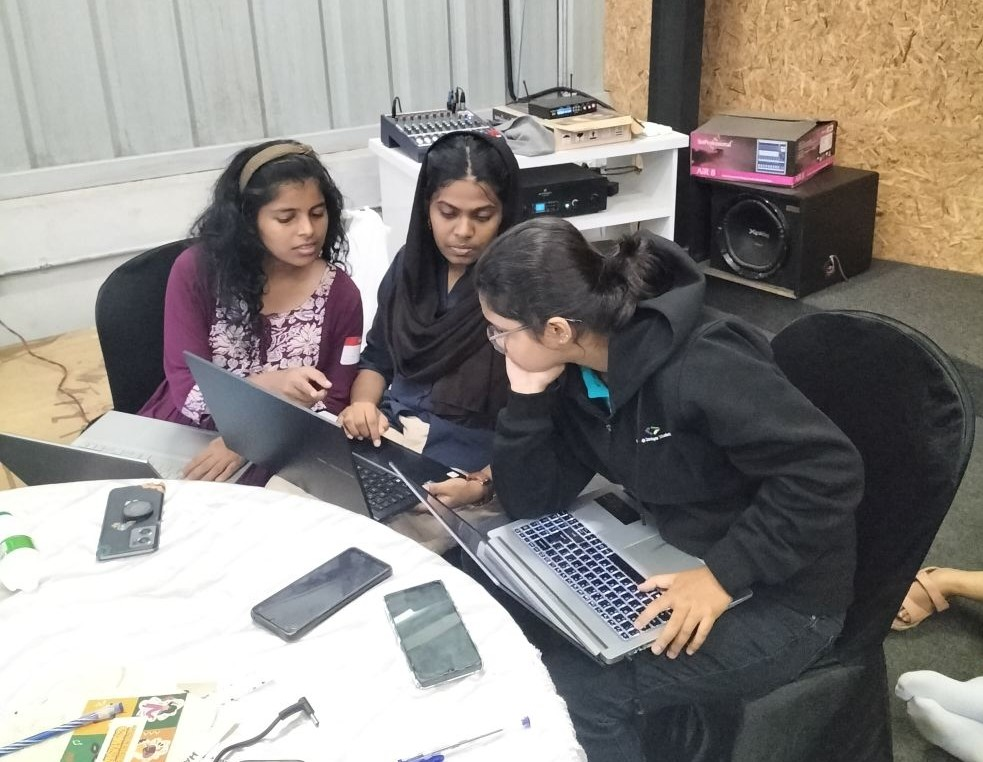

# Flutune🎯

## Basic Details
### Team Name: Cinnamon

### Team Members
- Member 1: Sindhu P R - CUSAT
- Member 2: Shahana Sherin - CUSAT
- Member 3: Revathy M R - CUSAT

### Hosted Project Link
[flutune.vercel.app](http://flutune.vercel.app/)

## Overview

This web application is designed to detect and analyze chords in audio files or from YouTube videos. It provides an intuitive interface for musicians, music students, or anyone interested in chord analysis.

## Features

- Audio file upload functionality
- YouTube URL input for online video analysis
- Drag-and-drop interface for easy file uploading
- Real-time chord detection and analysis
- Responsive design for various screen sizes
- Animated user interface for enhanced user experience

### The Problem statement
Beginner flutists face a significant challenge in accessing accurate musical notes for songs they wish to learn. While digital platforms offer numerous tutorials and audio resources, there is a lack of reliable tools to convert audio into precise flute notation.
### The Solution

Flutune transforms this challenge into an opportunity by offering an intuitive web application that instantly converts any audio file or YouTube song into flute-friendly notes

## Technical Details
### Technologies/Components Used
For Software:
- REACT
- VITE
- Fast API

### Implementation
For Software:
# Installation
[commands]

# Run
[commands]

### Project Documentation
For Software:

# Screenshots (Add at least 3)

This page is the initial page where the user can upload the file or youtube link 

This page shows the loading of the files and notes

This is the last page which shows the result,the notes are shown there and from there the note can be downloaded too

# Diagrams

The Flutune workflow begins with user input through either audio file upload or YouTube URL. Once received, the system processes the audio to extract the melody and identify individual notes. In the backend, noise is removed from the audio. The clean audio is then analyzed to identify frequencies, which are converted into corresponding musical notes. The results are then displayed on screen with an option to download 
 as txt for practice or adding extra notes.

# Build Photos

### Project Demo
# Video
[my video](./Flutune - Google Chrome 2025-02-02 10-37-33 (1).mp4")
The video demo shows the user journey. The user uploads the audio file or the youtube link. There is a pretty cute loading screen and then we get the flute notes of the song. 

## Team Contributions
- [Sindhu P R]: [Backend Endpoints]
- [Revathy M R]: [Styling and Integration]
- [Shahana Sherin]: [Frontent Pages]

---
Made with ❤️ at TinkerHub
