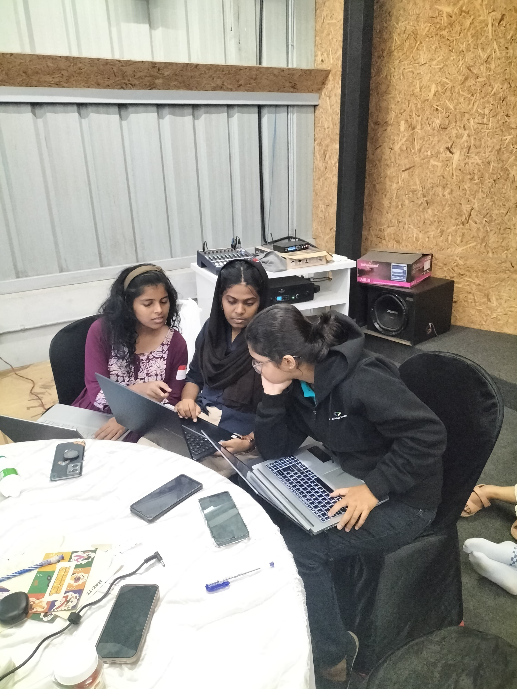

# Flutune🎯

## Basic Details
### Team Name: Cinnamon

### Team Members
- Member 1: Sindhu P R - CUSAT
- Member 2: Shahana Sherin - CUSAT
- Member 3: Revathy M R - CUSAT

### Hosted Project Link
[mention your project hosted project link here]

## Overview

This web application is designed to detect and analyze chords in audio files or from YouTube videos. It provides an intuitive interface for musicians, music students, or anyone interested in chord analysis.

## Features

- Audio file upload functionality
- YouTube URL input for online video analysis
- Drag-and-drop interface for easy file uploading
- Real-time chord detection and analysis
- Responsive design for various screen sizes
- Animated user interface for enhanced user experience

### The Problem statement
Beginner flutists face a significant challenge in accessing accurate musical notes for songs they wish to learn. While digital platforms offer numerous tutorials and audio resources, there is a lack of reliable tools to convert audio into precise flute notation.
### The Solution

Flutune transforms this challenge into an opportunity by offering an intuitive web application that:

Instantly converts any audio file or YouTube song into flute-friendly notes

## Technical Details
### Technologies/Components Used
For Software:
- REACT
- VITE
- Fast API

### Implementation
For Software:
# Installation
[commands]

# Run
[commands]

### Project Documentation
For Software:

# Screenshots (Add at least 3)

*Add caption explaining what this shows*

*Add caption explaining what this shows*

*Add caption explaining what this shows*

# Diagrams

The Flutune workflow begins with user input through either audio file upload or YouTube URL. Once received, the system processes the audio to extract the melody and identify individual notes. In the backend, noise is removed from the audio using noise reduction algorithms. The clean audio is then analyzed to identify frequencies, which are converted into corresponding musical notes. The results are then displayed on screen with an option to download for practice.

# Build Photos

*Explain the final build*

### Project Demo
# Video
[Add your demo video link here]
*Explain what the video demonstrates*

# Additional Demos
[Add any extra demo materials/links]

## Team Contributions
- [Sindhu P R]: [Specific contributions]
- [Revathy M R]: [Specific contributions]
- [Shahana Sherin]: [Specific contributions]

---
Made with ❤️ at TinkerHub
